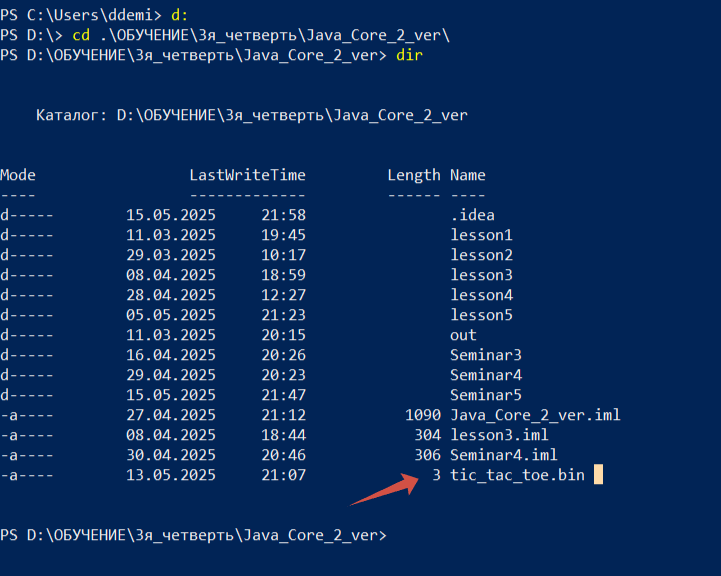
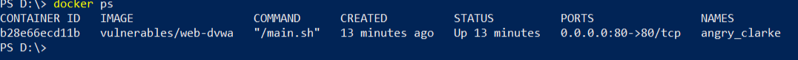

# Java Core (семинары)  

## Урок 5. Тонкости работы

### 1. Резервное копирование файлов в директории ./backup
Написать функцию, создающую резервную копию всех файлов в директории
(без поддиректорий) во вновь созданную папку ./backup
```java
import java.io.IOException;
import java.nio.file.*;

public class FileBackup {

    public void backupFiles(String sourceDir) throws IOException {
        Path backupDir = Paths.get(sourceDir, "backup");

        // Создаем папку backup, если её нет
        if (!Files.exists(backupDir)) {
            Files.createDirectory(backupDir);
        }

        // Копируем все файлы (без поддиректорий)
        try (DirectoryStream<Path> stream = Files.newDirectoryStream(Paths.get(sourceDir))) {
            for (Path file : stream) {
                if (Files.isRegularFile(file)) {
                    Path target = backupDir.resolve(file.getFileName());
                    Files.copy(file, target, StandardCopyOption.REPLACE_EXISTING);
                }
            }
        }

        System.out.println("Резервные копии созданы в: " + backupDir.toAbsolutePath());
    }

}
```
В результате выполнения кода в корневой папке будет создана директория с именем "backup"


### 2. Упаковка/распаковка поля крестиков-ноликов в 3 байта
Предположить, что числа в исходном массиве из 9 элементов имеют диапазон[0, 3], и представляют собой, например, состояния ячеек поля для игры в крестикинолики,
где 0 – это пустое поле, 1 – это поле с крестиком, 2 – это поле с ноликом, 3 – резервное значение. Такое предположение позволит хранить в одном числе типа int всё поле 3х3.
Записать в файл 9 значений так, чтобы они заняли три байта.
```java
import java.io.*;
import java.util.Arrays;

public class TicTacToePacker {

    // Упаковывает массив из 9 элементов (0-3) в 3 байта
    public byte[] packField(int[] field) {
        if (field.length != 9) {
            throw new IllegalArgumentException("Поле должно содержать 9 элементов");
        }

        byte[] packed = new byte[3];
        for (int i = 0; i < 3; i++) {
            int offset = i * 3;
            packed[i] = (byte) (
                    (field[offset] << 6) |
                            (field[offset + 1] << 4) |
                            (field[offset + 2] << 2)
            );
        }
        return packed;
    }

    // Распаковывает 3 байта обратно в массив из 9 элементов
    public int[] unpackField(byte[] packed) {
        int[] field = new int[9];
        for (int i = 0; i < 3; i++) {
            int offset = i * 3;
            field[offset] = (packed[i] >> 6) & 0b11;
            field[offset + 1] = (packed[i] >> 4) & 0b11;
            field[offset + 2] = (packed[i] >> 2) & 0b11;
        }
        return field;
    }
}
```
````java
import java.io.FileOutputStream;
import java.io.IOException;
import java.nio.file.*;
import java.util.Arrays;

public class Main {
    public static void main(String[] args) throws IOException {
        try {
            new FileBackup().backupFiles("D:\\ОБУЧЕНИЕ\\3я_четверть\\Java_Core_2_ver\\Seminar5"); // Текущая директория
        } catch (IOException e) {
            System.err.println("Ошибка при создании резервной копии: " + e.getMessage());
        }

        // Пример поля (0 - пусто, 1 - X, 2 - O, 3 - резерв)
        int[] exampleField = {1, 0, 2, 0, 1, 0, 2, 0, 1};
        TicTacToePacker packer = new TicTacToePacker();

        // Упаковываем и сохраняем в файл
        byte[] packed = packer.packField(exampleField);
        try (FileOutputStream fos = new FileOutputStream("tic_tac_toe.bin")) {
            fos.write(packed);
        }

        // Читаем и распаковываем
        byte[] readBytes = Files.readAllBytes(Paths.get("tic_tac_toe.bin"));
        int[] unpackedField = packer.unpackField(readBytes);

        System.out.println("Исходное поле: " + Arrays.toString(exampleField));
        System.out.println("Распакованное поле: " + Arrays.toString(unpackedField));
    }
}
````
В результате выполнения кода  создается файл с 9 значениями, размеров три байта


### 3. Запуск приложения dvwa-docker
Пример команды для запуска:
````shell
docker run --rm -it -p 80:80 vulnerables/web-dvwa
````
Подтверждение запущенного контейнера

